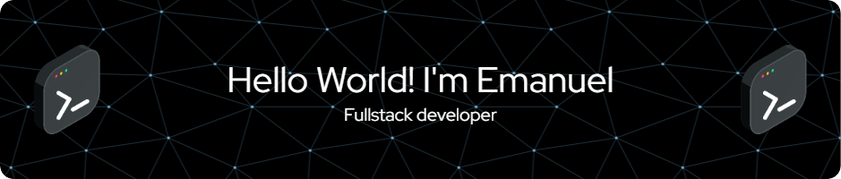

I'm Emanuel Arias, Fullstack developer from Barranquilla, Colombia 
- 🔭 I’m currently working on a mobile app with .NET MAUI, C#, REST API, SQL server 
- 🌱 I’m currently learning 
---

###   

---

 

---

### Technologies & Tools 🛠

---

<!--
**emanuelarias9/emanuelarias9** is a ✨ _special_ ✨ repository because its `README.md` (this file) appears on your GitHub profile.

Here are some ideas to get you started:

- 👯 I’m looking to collaborate on ...
- 🤔 I’m looking for help with ...
- 💬 Ask me about ...
- 📫 How to reach me: ...
- 😄 Pronouns: ...
- ⚡ Fun fact: ...
-->
